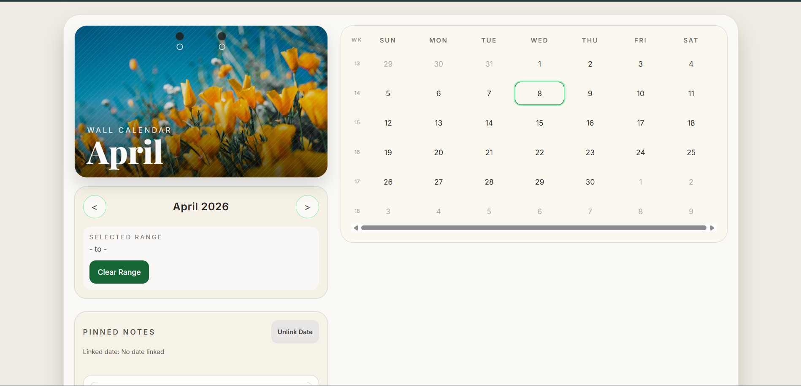

# WallCalendar

A design-forward, interactive wall calendar built with Next.js 14 (App Router), TypeScript, and Tailwind CSS.

## Preview



## Component Overview

The `WallCalendar` component is a tactile calendar experience that combines:

- A season-aware hero panel with month-specific imagery.
- A responsive calendar grid with range selection, week numbers, and holiday markers.
- A sticky-note style notes panel with local persistence.
- Print-friendly output focused on the hero and month grid.

Core files:

- `components/WallCalendar/index.tsx`: main composition, month flip transition, seasonal theming.
- `components/WallCalendar/MonthHeroImage.tsx`: hero artwork and month title treatment.
- `components/WallCalendar/CalendarGrid.tsx`: 6x7 month grid, keyboard navigation, holiday indicators.
- `components/WallCalendar/DateRangeSelector.tsx`: month controls and range summary.
- `components/WallCalendar/NotesPanel.tsx`: note creation, color selection, and note cards.
- `hooks/useCalendar.ts`, `hooks/useDateRange.ts`, `hooks/useNotes.ts`: calendar, range, and persistence logic.

## Run Locally

```bash
npm install
npm run dev
```

Open http://localhost:3000.

## Key Design Decisions

- Physical wall-calendar aesthetic:
	- Cream/paper tones, textured overlays, and hanging-card shadow.
	- Punch-hole visual details in the hero panel.
- Seasonal theming:
	- Accent colors update by month group (Winter, Spring, Summer, Autumn).
	- Shared accent tokens are applied across range states, rings, and note borders.
- Accessibility-first interactions:
	- Explicit ARIA labels on interactive controls.
	- Keyboard navigation in grid (arrow keys), Enter/Space select, Escape clears range.
	- `aria-selected` semantics for day cells.
- Robust persistence:
	- `localStorage` access is guarded for SSR and wrapped in `try/catch` for runtime safety.
- Responsive behavior:
	- Mobile-first stacked layout, touch-sized day buttons, constrained hero height.
	- Desktop split layout with content hierarchy.
- Initial rendering polish:
	- Lightweight pulse skeleton for hero and grid on first render.

## Features

- 6x7 calendar month grid with overflow days.
- Previous/next month navigation with 3D flip transition.
- Date-range selection with start/end and in-range bridge styling.
- ISO week numbers in a dedicated left grid column.
- Indian public holiday markers (static 2025 map) with hover tooltips.
- Sticky notes with optional date links, pastel color selection, and delete actions.
- Local note persistence across reloads.
- Print styles that hide notes and controls for clean month printing.
